# Final Project Report
This is the culmination of all the work I've done this semester. Enjoy!

# Tables of Contents
1. [Project Summary](#summary)
    1. [Background](#back)
    2. [Hypothesis](#hyp)
2. [Process](#process)
3. [Analysis](#analysis)
    1. [Lexical Complexity](#lex)
    2. [Expressive Forms](#adj)
    3. [Hedges](#hedge)
    4. [Politeness](#polite)
    5. [Commands/Collaboration](#command)
4. [Abandoned Pursuits](#fails)
    1. [Exclamation, Question, Ellipsis Count](#punc)
    2. [Topic by Gender](#topics)
5. [Further Analysis](#further)

## Project Summary 
My project investigates gender differences in dialogue in animated movies. It looks at 13 Disney princess movies and 9 Dreamworks movies to see whether female 
characters tend to adhere to what is thought of as traditionally "feminine" language.

### Background
This project really started last semester. I was investigating how command use changed over time in Disney princess movies. I had to physically count all the 
commands uttered! It was exhausting... And since I only looked at three movies, my findings weren't very significant. With bigger data, and the power of 
Python, this project is meant to take my questions about gendered dialogue to the next level.

Specifically, I want to look at how female language use changes over time in these movies, how they vary based on production company, and if other factors like characters' roles influence how they speak.

### Hypothesis
Robin Lakoff created a list of features associated with female speech. (See my 
[powerpoint](https://github.com/Data-Science-for-Linguists-2019/Animated-Movie-Gendered-Dialogue/blob/master/Project_Presentation.pdf) for a list used by Cameron 
and Kulick, 2003.) However, 
linguists have noted that these features are really features of powerless language (Eckert, Penelope, and Sally McConnell-Ginet. 2013. Language and Gender. 2Nd 
Edition. New York & Cambridge: Cambridge University Press). 

I have three big questions:
* Do female characters use these "feminine" features more or less depending on production company?
* Do Disney female characters use these features less often over time?
* Are some features attributable to whether a character is a protagonist or antagonist, and not male or female? 

My general hypothesis is: Both power and social circles play into these results. A female protagonist is more likely to be under the social microscope. She's 
someone young girls are meant to look up to, and tends to fit the societally ideal female. As such, she will use the features typical of traditionally female 
speech. Female antagonists, on the 
other hand, live 
outside of these social constraints. Unburdened from the social expectations of a "good" woman, and often in positions of power within their own social 
spheres, female antagonists will not exhibit these "feminine" features. Furthermore, as Disney has aged, social expectations of girls have changed. Their role 
models, the Disney Princesses, will reflect these changes in social expecatations. Similarly, many Dreamworks female protagonists are not princesses, nor are they 
the main character of the story. They also won't have to reach certain social expectations of the ideal girl. 

In summary, I believe that: 
* Female Disney characters will use these feminine features less often in the later eras of Disney.
* Female protagonists will use these features more often than female antagonists.
* Female characters in DreamWorks movies won't use these feminine features as often as Disney female characters.

## Process

For the sources of my data, see [project_plan.md](https://github.com/Data-Science-for-Linguists-2019/Animated-Movie-Gendered-Dialogue/blob/master/project_plan.md).

This project involved a LOT of data cleaning. For how I annotated and edited by data, go to my code. The [Disney 
movies](https://github.com/Data-Science-for-Linguists-2019/Animated-Movie-Gendered-Dialogue/tree/master/code/Disney_code) was mostly annotation, with some web 
scraping for particularly messy data. The [DreamWorks 
movies](https://github.com/Data-Science-for-Linguists-2019/Animated-Movie-Gendered-Dialogue/tree/master/code/DreamWorks_code) were all scripts formatted as text 
files. I had to find a way to split these by line through [analyzing white 
space](https://github.com/Data-Science-for-Linguists-2019/Animated-Movie-Gendered-Dialogue/blob/master/code/DreamWorks_code/Analyzing_White_Space.ipynb).

Each entry in my dataframe contains the following: Text, the speaker, the gender of the speaker (male, female, or neutral), the role of the speaker 
(protagonist, antagonist, helper, or neutral), the status of the speaker (princess, prince, or neither), the year of the movie, the movie name, whether the line is 
song or dialogue, the line's utterance number in the film, and the movie's period. Period in this case only applies to Disney Movies. The 'EARLY' period in my data 
denotes Classic movies--Snow White, Cinderella, and Sleeping Beauty. The 'MID' period denotes Disney Renaissance movies--The Little Mermaid, Aladdin, Beauty and the 
Beast, and Mulan. The 'LATE' period denotes movies from the Disney Revival period--Princess and the Frog, Tangled, Frozen, and Moana.

In my final dataframe, I filtered out all songs and blank lines. Though songs are an important part of Disney movies, I decided to drop them for a couple reasons.
One, they are very long and repetitive compared to regular dialogue, and this may influence some of my stats, like token count and TTR. Also, most Dreamworks movies 
don't have songs. Overall, I wanted to specifically look at
spoken dialogue between characters--I didn't need songs for this. 

My final dataframe is 13442 lines long, though not all lines were used in analysis. I wanted to look at gender and role, so when investigating these relationships, 
any characters not marked with a specific gender (male or female) or role (antagonist, protagonist, or helper) were dropped.

## Analysis
For this analysis, I look at three different aspects of Lakoff's list, as well as lexical complexity and commands, which I investigated last semester. Specifically, 
I look at:
* Lexical Complexity: Token and Type Counts, TTR, and K-Band
* Expressive Forms: Adjectives
* Hedging: counts of hedge words and phrases
* Politeness: counts of polite phrases and apologies
* Collaboration and Indirectness: counts of tag questions and different types of commands

### Lexical Complexity
My hypothesis:
* Disney female protagonists will have longer lines and better vocabulary than DreamWorks female characters. They are the main characters after all.
* Disney female protagonist token counts will go up over time, as they play a more active role in their movies.
* Female antagonists don't appear as much, and will have shorter lines.

First, let's look at a couple visualizations:

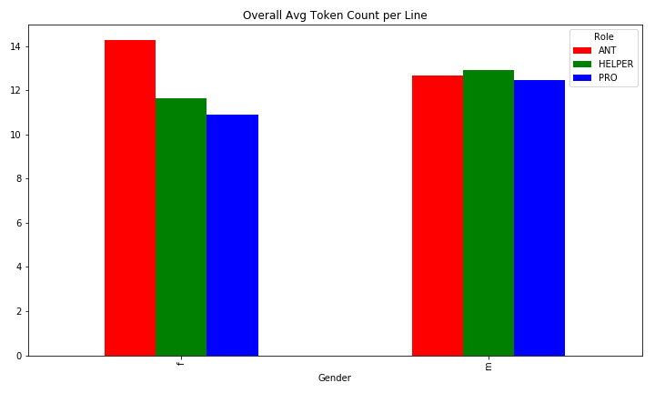
This suggests that female antagonists actually have longer lines than both male antagonists and female protagonists! Perhaps villains are more longwinded?

Also, female antagonists seem to have higher TTRs than protagonists--male or female! Might this suggest a more refined vocabulary in villains?

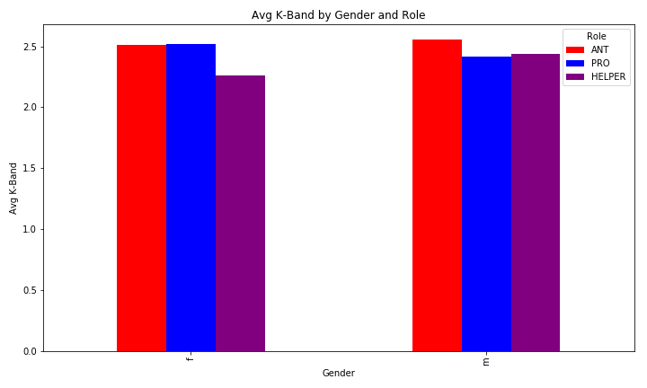

K-Bands are also ways to measure vocabulary level, and here, the differences between males and females, and protagonists and antagonists, are very small.

Token Count by line seems to be significant! Of course, significance tests need to be performed to confirm or deny this. The following three tables are the results 
of my 
[t-tests](https://github.com/Data-Science-for-Linguists-2019/Animated-Movie-Gendered-Dialogue/blob/master/code/Analysis_code/Significance_Tests_Token_Type_TTR.ipynb) 
on the 
features I used to track lexical complexity. Any significant tests are 
highlighted in green. Also note that the sign of the "stat" number is consistent with the order in which the comparison is listed. For instance, Disney M v DW M 
means a t-test was performed between male Disney characters and male Dreamworks characters. The first Stat value +3.19, implies that the average for male Disney 
characters 
was higher. The lower entry -2.67 indicates the average for Disney male characters was less than that of the male Dreamworks characters. 

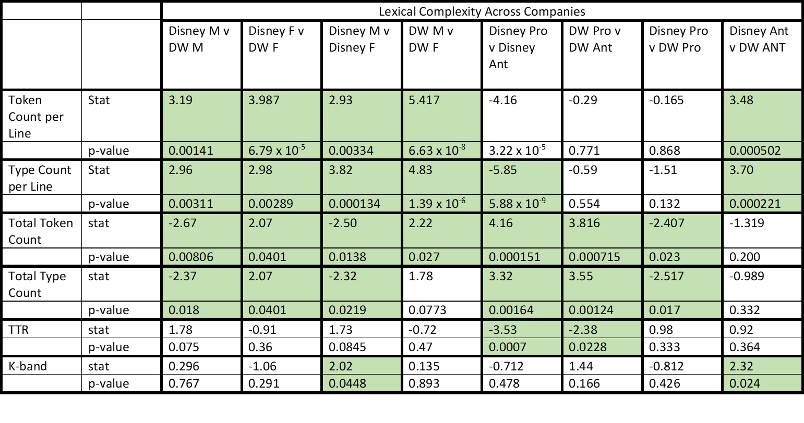

These results support my hypothesis concerning female Dreamworks and Disney 
characters.

From the Disney Female v DW Female column, we see that in Token Count by 
Line, Type Count by Line, Total Token Count, and Total Type Count, Disney 
female characters have consisently and significantly higher counts. 

Observe that by line, Disney male characters actually have a higher token 
count and a higher type count than female Disney characters! This 
seems to go against the idea that the main protagonist should have the 
longest lines. But also observe: when you look at total token and type 
counts per character, female Disney characters are significantly higher than 
male Disney characters. So, while male Disney characters may talk more 
during individual utterances, overall female Disney characters are talking the 
most.

Keeping this in mind, this would imply that female Disney characters speak 
longer per line than female Dreamworks characters, AND female Disney 
characters have more speaking time overall than female Dreamworks characters.

Notice, though, that female Disney characters don't have a higher TTR or 
K-Band than female Dreamworks characters. Overall, any differences in TTR and K-band were insignificant. The only exception 
here is looking at protagonists vs antagonists within each company. For both 
Disney and Dreamworks, protagonists have significantly lower TTRs than their 
antagonists. This may hint at a higher vocabulary for villains. Does this 
vary based on villain gender?

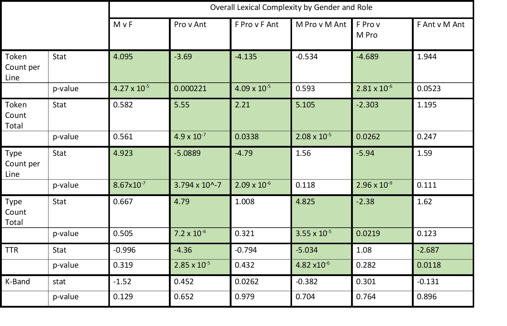

It appears that female antagonists actually have a significantly lower TTR 
than their male counterparts. And the t-test between female protagonists and 
antagonists shows that there's no major differences in TTR. However, female 
antagonsits DO have a much higher token count per line than female 
protagonists.

The next question then would be: why is this? Do female antagonists hold the 
floor for longer because of their position of power? Perhaps they're less 
likely to be collaborative with others in the dialogue. Perhaps they're 
less likely to be interrupted. (For a failed look at interruption, see 
Abandoned Pursuits below). 

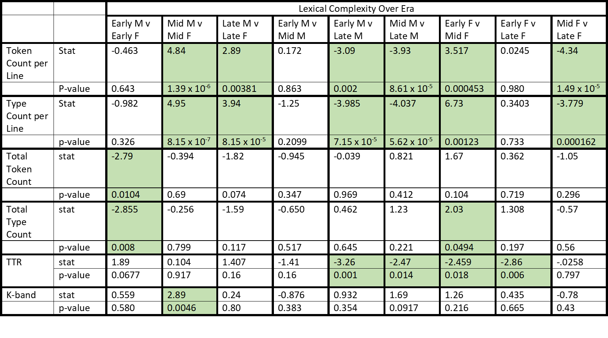

Though I thought that female token counts would go up over time, I've found 
that this isn't consistent over time. In looking at the last three columns 
comparing 
female characters over the early, mid, and late periods, we see that token 
and type count per line were actually significanlty higher in the early period 
than in the 
middle period, while the middle period's token and type counts per line were 
significantly less than those of the late period. In contrast, we see that 
male token and type counts per line have gone up more 
consistently and significantly over 
time.

However, we do see that TTR for female characters is significantly higher in 
the late and mid periods than in the early period. Though token count may 
not be consistent, the vocabulary used by the female characters has increased. (Though this isn't unique to female characters--male TTR goes up over time as well).

Another interesting observation is that men have higher token and type counts per line than females in every era except the earliest one! And in the early period, 
female characters had significantly higher total token and total type counts. A possible reason for this is the lack of male lead characters in the earliest era. 
Sure, 
there are princes, but they don't talk very much at all. That only leaves supporting male characters, who don't speak much overall.

In fact, the distribution of characters by gender is an important thing to consider here. Consider the following graph of total line count by gender:

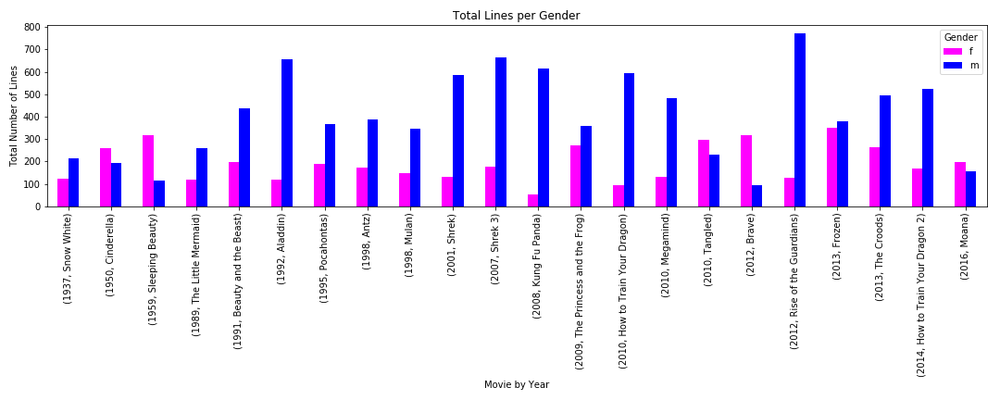

From the looks of this, male characters seem to dominate! But when you normalize this over the number of characters of each gender for each movie, you get a very 
different 
picture:

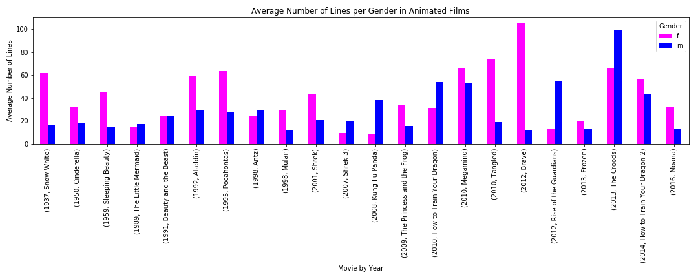

We see that in several of the Disney movies, and even some Dreamworks movies, female characters individually average more lines than male characters. Considerations 
like this, as well as token count per line, were taken into account when doing the next portion of analysis: Adjective Counts.

### Expressive Forms

Lakoff suggests that women use more expressive forms than men. Do women really use more adjectives than men?

I hypothesize that: 
* Female protagonists will use more adjectives than male protagonists
* Female Disney characters will use adjectives more than their DreamWorks counterparts
* Female Disney characters will use adjectives less often over time.
* Female villains will refrain from flowery language, and use fewer adjectives.

To assess my hypothesis, I decided I shouldn't use raw adjective counts per line. We saw in the bar graphs above that antagonists tend to have longer lines than 
protagonists, and 
male characters tend to have longer lines than female characters. The longer a line is, the more likely it is that more adjectives will appear in it. So, I decided 
I would [divide the adjective 
count](https://nbviewer.jupyter.org/github/Data-Science-for-Linguists-2019/Animated-Movie-Gendered-Dialogue/code/Analysis_code/POS_Tag_Adj_Analysis.ipynb#adj2) 
in each 
line by the token count of the line. Look at the difference this makes:

The differences between female and male antagonists, female and male protagonists, and female villains and heroes which seemed large in the first graph have been 
balanced out--and now aren't so significant. But they ensure that token count isn't influencing our results!

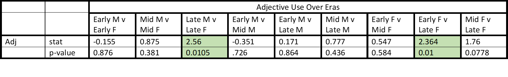
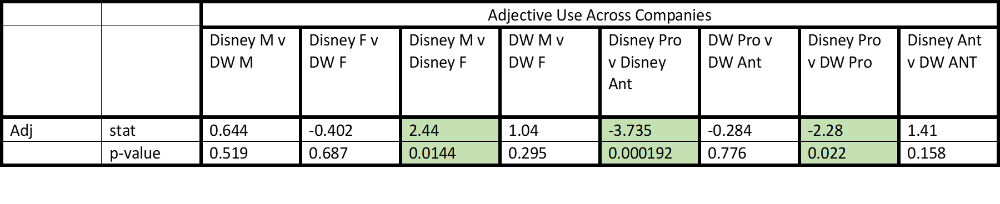

These results actually contradict my hypothesis. From the Overall Adjective 
Use by Gender and Role Table, we see that male protagonists actually use 
more adjectives than female protagonists!

In terms of DreamWorks vs Disney, there's no significant differences in how 
females use adjectives. The only difference across companies is how 
protagonists use adjectives.

In terms of adjective use over time, we do see adjective counts for female 
Disney characters go down significantly between the early and late period. 
Though the drops in adjectives were not significant between the early and 
mid period or the mid period and the late period, these drops accumuluated 
over time to create a significant difference. Interestingly, in the late 
period, when female adjectives have dropped, men use significantly more 
adjectives than females. 

Also, it looks like female villains actually use more adjectives than female 
heroes (p = 0.0301). Perhaps villains like to be descriptive with their evil 
plots?

One concern I have with my adjective stat is how small it is. Raw adjective 
counts per line can already be low, but then dividing this further by token 
count makes the stat much smaller. As values shrunk, I thought that maybe I 
wouldn't get significant results, or perhaps skewed results. In the 
following analyses, counts are also very small. 

### Hedges

Unlike adjectives, I decided not to average hedge counts over token count, 
mostly 
because some hedges used were [not single 
words](https://nbviewer.jupyter.org/github/Data-Science-for-Linguists-2019/Animated-Movie-Gendered-Dialogue/blob/master/code/Analysis_code/Hedges.ipynb#findhedge).

One aspect of this stat's results that I have concern with is what it 
captures. In this analysis, I used a list of words and phrases. Some hedges 
can mean different things based on context. For instance, "well..." can be a 
hedge, but it isn't a hedge when a character says "well, well, well..." Though 
I didn't account for this, it is something to take into account when looking 
at my results, perhaps with some skepticism.

Hedging is a method of saying something without taking a hard stand. I 
hypothesize that
* Female Disney characters will use these more than female Dreamworks 
characters
* Female villains will use these less than female protagonists
* Female protagonists will use them more than men
* Female characters will use fewer hedges over time

A quick look at a bar graph comparing gender and role counts immediately 
seems to contradict 
my hypotheses:

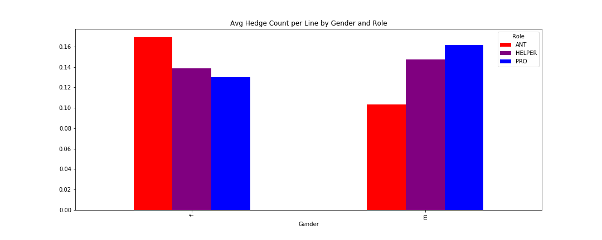

But this graph showing how hedge counts have changed over time shows that my 
hypothesis about female hedge count over time may be valid:

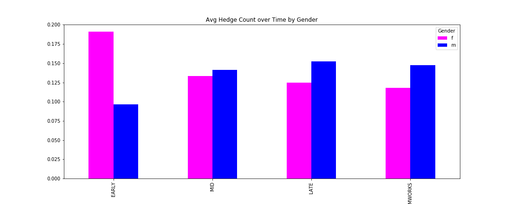

It looks like females hedge less over time, while males hedge more over 
time. 

Let's look at hedges over time first:

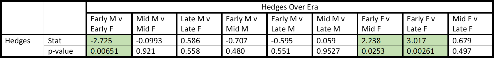

Here, we see that female characters use hedges significantly less in the 
middle and late periods than in the early period. Though they also use fewer 
in the late period when compared to the middle period (indicated by the positive stat value), this difference is 
not significant. Also, we see on the far left of the table that in the early 
period, men used significantly fewer hedges than women, but male use of 
hedges doesn't change significantly over time. This implies that hedge use 
between genders evened out in the middle and late periods not so much due to both 
genders met in the middle, but more because female characters stopped using them 
so much.

If we look at hedge use across companies, we see that there's no significant 
differences based on gender:

In looking at gender and role overall, we see that differences occur when 
gender and role interact:

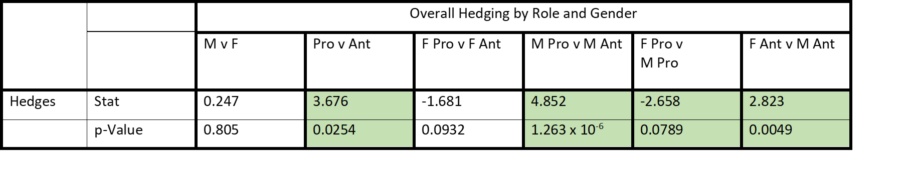

Protagonists use more hedges than antagonists, but the difference between 
female protagonists and female antagonists isn't signficant. Oddly, female 
protagonists actually use hedges significantly less than male protagonists 
do, but female antagonists use significantly MORE hedges than male 
antagonists. This difference isn't simply attributable to gender or role. I 
personally have no idea why this might be, but it would be something 
interesting to investigate in the future.

### Politeness

These counts were also pretty low when I [found 
them](https://nbviewer.jupyter/github/Data-Science-for-Linguists-2019/Animated-Movie-Gendered-Dialogue/blob/master/code/Analysis_code/Politeness_and_Apology.ipynb#find), 
so I 
didn't expect to get many significant results--but this ended up yielding 
some of the most significant results! I consider polite forms like "please" 
and "thank you" separately from apologies like "sorry". 

I hypothesized that:
* Female protagonists will apologize more and be more polite than male 
protagonists and female villains
* Disney females will be more polite than DreamWorks females
* Over time, female characters will apologize less and be less polite

From a quick look at the distributions, I'd say most of my hypotheses are on 
track:

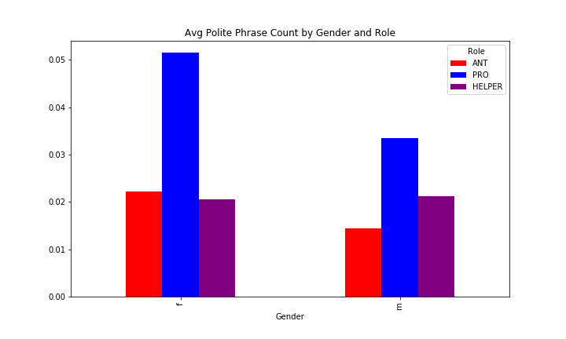

Except for my politeness over time hypothesis. Female Disney characters seem 
to be getting more polite!

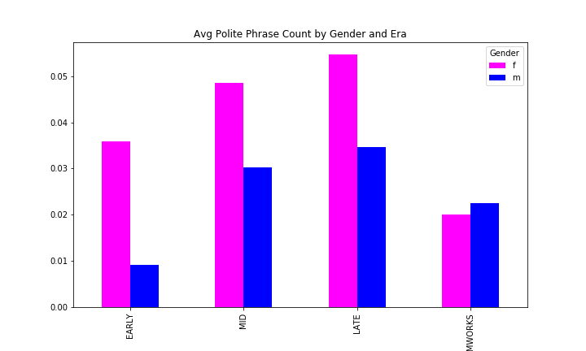

Though, this may be influenced by token count. Like hedging, I did not 
average this stat over token count due to multi-word hedges.

Taking a look at the [t-test 
results](https://nbviewer.jupyter.org/github/Data-Science-for-Linguists-2019/Animated-Movie-Gendered-Dialogue/blob/master/code/Analysis_code/Politeness_and_Apology.ipynb#spo), 
we find some pretty significant 
differences:

Though the insignificant t-test results indicate that my hypothesis about 
female speakers becomes less polite over time is wrong, we do find something else 
interesting. In every single era, male speakers are significantly less 
polite than female speakers, even though men have gotten significantly more 
polite over time.

Sure enough, men are significantly less polite than women (at least, 
according to my parameters of politeness). Also, protagonists are 
significantly more polite than antagonists, though female protagonists 
are still significantly more polite than male protagonists. What I find 
most interesting is the last column--female antagonists aren't more 
polite than male antagonists! So, though being female seems to influence 
the protagonist's politeness level, being female doesn't influence how 
polite the villains will be.

Though apology wasn't significant in the last table, here we see that protagonists consistently apologize more than antagonists, regardless of gender (though 
something could certainly be said about the female p-value being 1000 times smaller than the male p-value). In general, 
men don't apologize more or less than women.

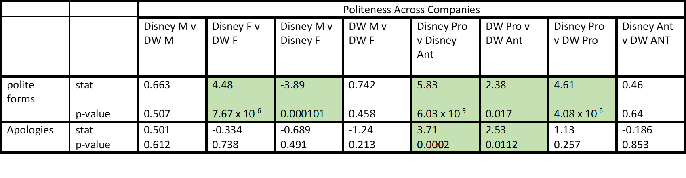

Looking across companies, we find some more interesting differences. Again, the significant difference between protagonists and antagonists apologizing is 
reflected in both Disney and DreamWorks heroes apologizing more than their antagonists. Also, my hypothesis about female characters across production companies is 
supported! Disney female characters do indeed use more polite forms than their DreamWorks counterparts. Also, interestingly, female DreamWorks characters aren't any 
more or less polite than their male counterparts. 

### Commands/Collaboration

Here, I've decided to look at 
[Tags](https://nbviewer.jupyter.org/github/Data-Science-for-Linguists-2019/Animated-Movie-Gendered-Dialogue/blob/master/code/Analysis_code/Tag_Questions.ipynb#code) 
and [3 types of 
command](https://nbviewer.jupyter.org/github/Data-Science-for-Linguists-2019/Animated-Movie-Gendered-Dialogue/blob/master/code/Analysis_code/Commands_Analysis.ipynb#fc): 
the 
imperative form (as in "stop!", the modal form (as in "you must stop!"), and suggestion (as in "you should stop.") . In line with the idea that women are more 
collaborative 
than combative, I believe that 
* female protagonists will use more suggestion and modal forms of command than male protagonists will.
* female villains will use more imperative commands than female protagonists
* females will use more imperatives over time
* Disney female characters will use fewer imperative commands than DreamWorks female characters

From these two graphs, one can see that modal and imperative command distributions do vary according to gender and role:

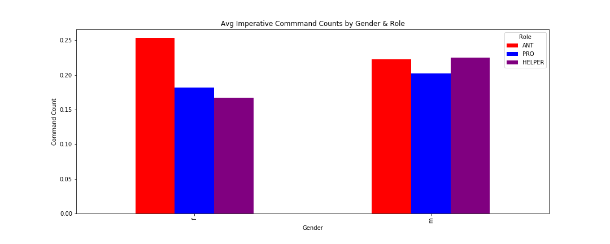
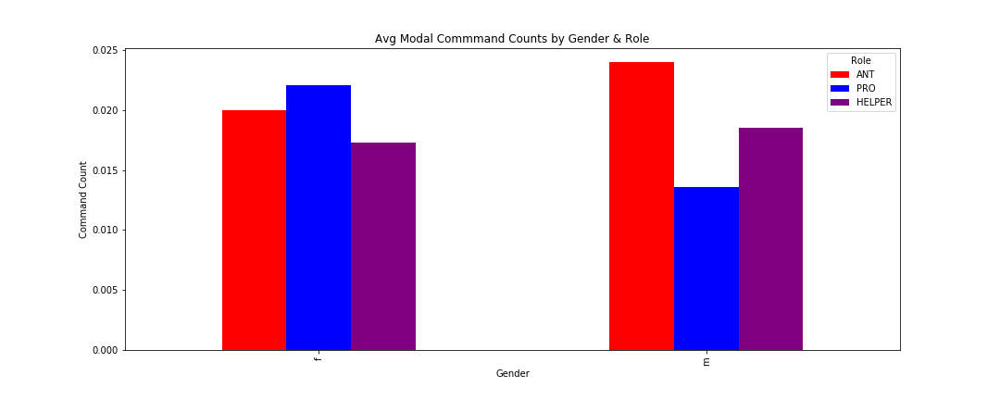

In terms of Tags, I hypothesize that
* female villains will use them less than female protagonists
* female protagonists will use them more than male protagonists
* Disney female charactres will use tags more than DreamWorks female characters
* female characters will use them less over time

From the looks of this distribution, there don't seem to be many glaring differences in tag counts by role and gender:

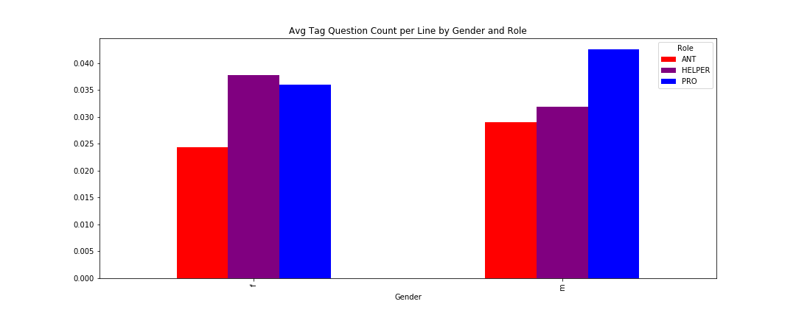

However, it looks like in male antagonists and male protagonists actually use tags more.

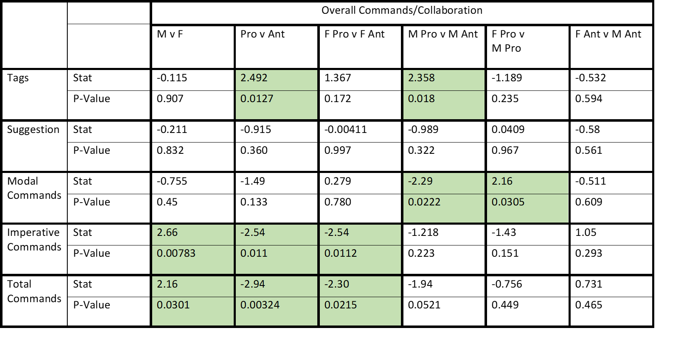

Here, we see that there's no significant difference between how female and male characters use modals or suggestion. But male characters use signficantly more 
imperative forms! Also, we see that female villains do indeed use significantly more imperatives than female protagonists, and all differences between command 
counts for male and female villains are insignificant. Meanwhile, the difference across the male 
villains and protagonists is insignificant--female villains seem to use just as many commands as all male characters.

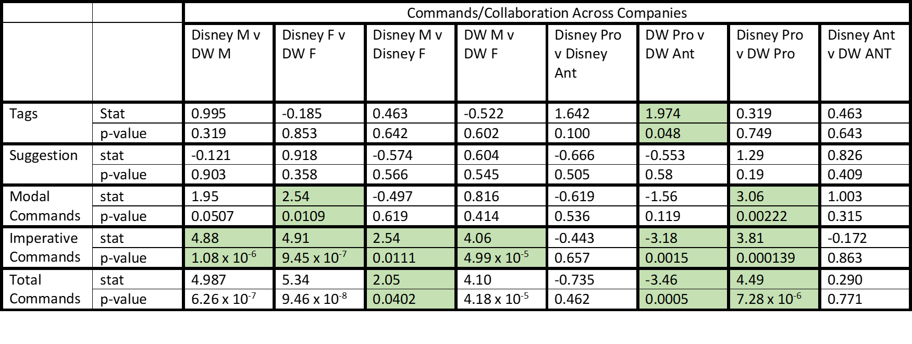

Comparing across companies, there is a significant difference between how female Disney characters and female DreamWorks characters use imperatives, but Disney 
female characters actually use them more. Also, female Disney characters do use significantly more modals. Disney characters in general, regardless of gender, use 
more commands than Dreamworks characters.

In terms of tags, there aren't many signficant differences pertaining to our hypotheses except that in general, protagonists use tags more often than villains.

## Abandoned Pursuits 

There were some stats that I began working on that I stopped pursuing. They can be found in my [old code 
folder](https://github.com/Data-Science-for-Linguists-2019/Animated-Movie-Gendered-Dialogue/tree/master/code/old_code). These include punctuation analysis, like 
[exclamation mark counts, question mark counts, ellipses 
counts](https://github.com/Data-Science-for-Linguists-2019/Animated-Movie-Gendered-Dialogue/blob/master/code/old_code/Questions_Exclamations_Etc.ipynb), and 
[interruption marks](https://github.com/Data-Science-for-Linguists-2019/Animated-Movie-Gendered-Dialogue/blob/master/code/old_code/interruption.ipynb). The basic 
idea was that exclamations would signal confidence in an utterance, while questions and ellipses would indicate uncertainty and hesitancy. However, these 
punctuation marks can express such a wide variety of things that I decided they weren't the best features to investigate. If you want to see some visualizations of 
these distributions, though, check out my 
[PowerPoint](https://github.com/Data-Science-for-Linguists-2019/Animated-Movie-Gendered-Dialogue/blob/master/Project_Presentation.pdf). 

Interruption, included in Lakoff's list, was more promising, until I realized that interruption marks weren't distributed across all scripts equally. Because 
DreamWorks scripts tended to mark interruption much 
more than the Disney scripts I ended up with some messed up and potentially misleading stats, like the bar graph below.

This would suggest that no female villains whatsoever are interrupted. Dreamworks has exaclty one female villain (Spoiler alert--it's Rapunzel in Shrek the Third). 
Disney has a lot of female villains (the evil queen, Lady Tremaine, Maleficent, and Urusla). This made me very skeptical of my results. 

I also tried exploring topics by gender. This was an adventure that ended in nonsense results. See them with my old code 
[here](https://github.com/Data-Science-for-Linguists-2019/Animated-Movie-Gendered-Dialogue/blob/master/code/old_code/Topics_by_Gender.ipynb) and 
[here](https://github.com/Data-Science-for-Linguists-2019/Animated-Movie-Gendered-Dialogue/blob/master/code/old_code/Topics_by_Gender-Copy1.ipynb). I had a very 
hard 
time 
downloading pattern, which was necessary to lemmatize my text before generating topics with gensim. When I FINALLY got it installed, the topics were mostly 
gibberish, no matter if I used line by line analysis or processed all the tokens of each character together.

## Further Analysis 

As much as I found in this project, there's still a lot more to explore! I found some stats and significant differences, but much more work would have to be done to 
get to WHY I'm seeing these differences. I'm sure it goes much deeper than just gender and role. For instance, I didn't explore speaker status (which is annotated 
in the data), but being royalty or not could easily affect any of these stats.

My stats were also drawn from basic word lists or regular expressions, which may over- or under-capture what I'm really looking for. Refinements and different 
approaches to finding hedges, commands, polite phrases, and tag questions could seriously change my results! 

Furthermore, my analysis looks at lines of dialogue as independent, rather than interactive. All stats are found for each line, with no regard to the other lines or 
speakers in that scene. How a male, female, protagonist, or antagonist speaks is bound to be 
influenced by when, where, and why they are speaking, not to mention who they're speaking to! I looked at gendered dialogue, but not gender dynamics in dialogue, 
which would be equally interesting.

I welcome any questions, comments and/or suggestions to my project! If you've visited and what to leave a note, head over to my 
[guestbook](https://github.com/Data-Science-for-Linguists-2019/Class-Plaza/blob/master/guestbooks/guestbook_cassie.md).
	
